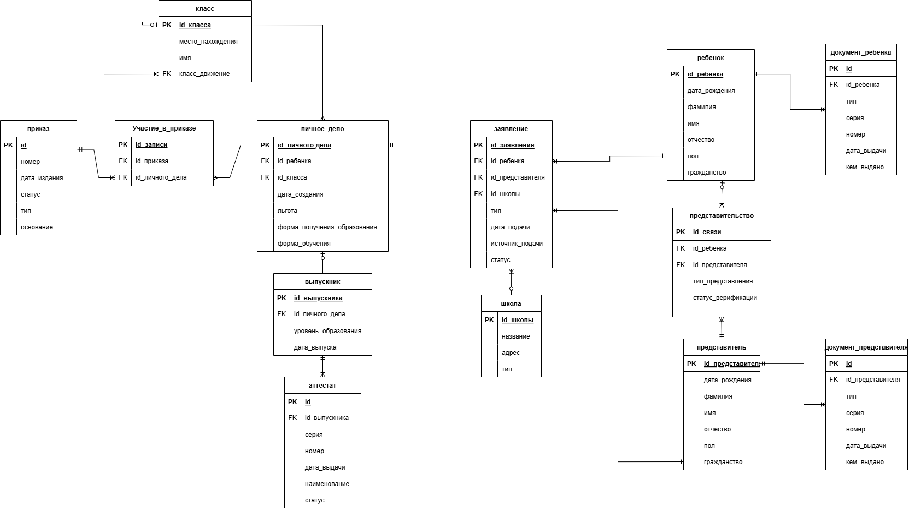

# SchoolContingent_DB
Проект по реализации базы данных для системы учета контингента в школах с представлением концептуальной, логической и физической схем, а также типовых запросов

# Модели баз данных
Концептуальная схема:  
     
Логическая схема:  
    
Физическая схема:  
     

Описание сущностей:  
- «Заявление». Отражает сведения о поданных заявлениях, об их типах, 

- «Ребенок». Данная таблица хранит основную таблицу о детях, которые в 
последствии станут обучающимися. Включены основные характеристики: ФИО, 
дата рождения, гражданство и пол. Таблица необходима для идентификации 
каждого ребенка.   

- «Представитель». В таблице представлена информация о законных 
представителях. Также содержит ФИО, дату рождения, пол, гражданство. Данная таблица рассматривает представителей как физических лиц, способных представлять интересы ребенка в образовательной организации.    

- «Документ ребенка». В данной таблице отражены основные официальные 
документы ребенка с указанием типа, серии и номера документа, причем набор 
документов для каждого ребенка может быть различным, так, для ребенка 
старше 14 лет основным документом, удостоверяющим личность является 
паспорт, а для ребенка младше данного возраста — свидетельство о рождении. 
Также возможно хранение иных документов,    

- «Документ представителя». Таблица для отображения данных 
представителя, так же с указанием типа, серии и номера.    

- «Представительство». Данная таблица необходима для разрешения связи 
«многие ко многим», так как ребенок может иметь несколько представителей, а 
представитель может представлять несколько детей. Также в данной таблице 
указывается тип представления — родитель или опекун, а также верификация, 
подтверждение представительства, реализованное через межведомственную 
проверку   

- «Школа». Справочная таблица, в которой отражены основные сведения о 
школе — название, адрес и тип (общеобразовательная школа, лицей гимназия и 
т.д.).    

- «Личное дело». Отражает основную информацию о ребенке, как об 
обучающемся — форму обучения (очная, заочная, очно-заочная) и форму 
получения образования (в организации, вне организации).  

- «Приказ». В данной таблице отражены приказы, связанные с 
образовательным процессом. Статусы «Черновик» и «Издан» позволяют 
контролироваться этапы подготовки приказа.   

- «Участие в приказе». Связывает личные дела и приказы, причем, с 
помощью данной таблицы разрешена связь «многие ко многим», так как есть 
возможность создания списочных приказов, что означает участие нескольких 
обучающихся в одном приказе, а также возможность создания различных 
приказов на конкретного обучающегося.   

- «Класс». Хранение информации о классах с возможностью отслеживания 
передвижения за счет рекурсивной связи.    

- «Выпускник». Архивирует данные об окончании обучения. Позволяет 
системе хранить историю выпусков, формировать статистику и выдавать 
подтверждающие документы. Отделение выпускников от текущих учеников 
упрощает управление активными записями.   

- «Аттестат». Данная таблица обеспечивает учёт документов об 
образовании. Статусы «Дубликат» и «Оригинал» позволяют обеспечивать 
историю выдачи аттестатов для каждого выпускника. Атрибут наименование 
позволяет разделят аттестаты по уровню образования (аттестат о среднем общем 
образовании или аттестат об основном общем образовании), а также получен 
аттестат с отличием или нет.   
